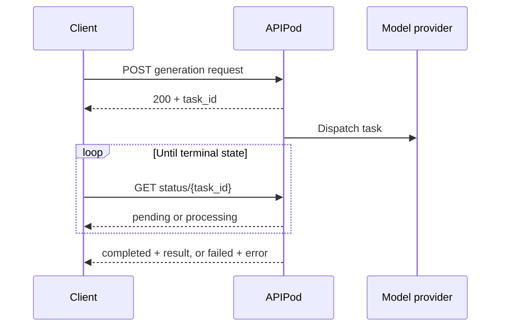

APIPod image and video generation is asynchronous. A create request returns quickly with a public `task_id`; generation continues after that HTTP request finishes.



## Lifecycle

| Status | Terminal | Client behavior |
| --- | --- | --- |
| `pending` | No | Wait before polling again |
| `processing` | No | Continue polling with backoff |
| `completed` | Yes | Read and persist the URLs in `result` |
| `failed` | Yes | Inspect the error and decide whether a new logical task is appropriate |
| `cancelled` | Yes | Stop polling |

An internal finalization stage is exposed as `processing`, so clients never need to handle a separate `finalizing` state.

## Polling endpoints

```bash
curl "https://api.apipod.ai/v1/images/status/$APIPOD_TASK_ID" \
  -H "Authorization: Bearer $APIPOD_API_KEY"
```

```bash
curl "https://api.apipod.ai/v1/videos/status/$APIPOD_TASK_ID" \
  -H "Authorization: Bearer $APIPOD_API_KEY"
```

Status queries are scoped to the authenticated account. A task from another account is not returned.

## Polling strategy

- Start with a short delay, then use bounded exponential backoff with jitter.
- Stop immediately on a terminal status.
- Honor `Retry-After` when the API supplies it.
- Persist the `task_id` before beginning background polling.
- Set an application deadline appropriate for the selected model; do not assume every model completes within the same duration.
- Treat an empty result as not yet deliverable even if an upstream operation has finished; APIPod keeps finalizing media before exposing it as completed.

## Image and video error fields

Image status responses can expose `error_code` and `error_message` in `data`. Video status responses expose the client-safe message as `error`. Webhooks use `error` and optional `error_code`. Always branch on `status` before reading result or error fields.

<CardGroup cols={2}>
  <Card title="Use webhooks" icon="webhook" href="/webhooks">
    Receive terminal task results without continuous polling.
  </Card>
  <Card title="Handle errors" icon="circle-alert" href="/error-codes">
    Normalize HTTP, synchronous, and asynchronous failures.
  </Card>
</CardGroup>
