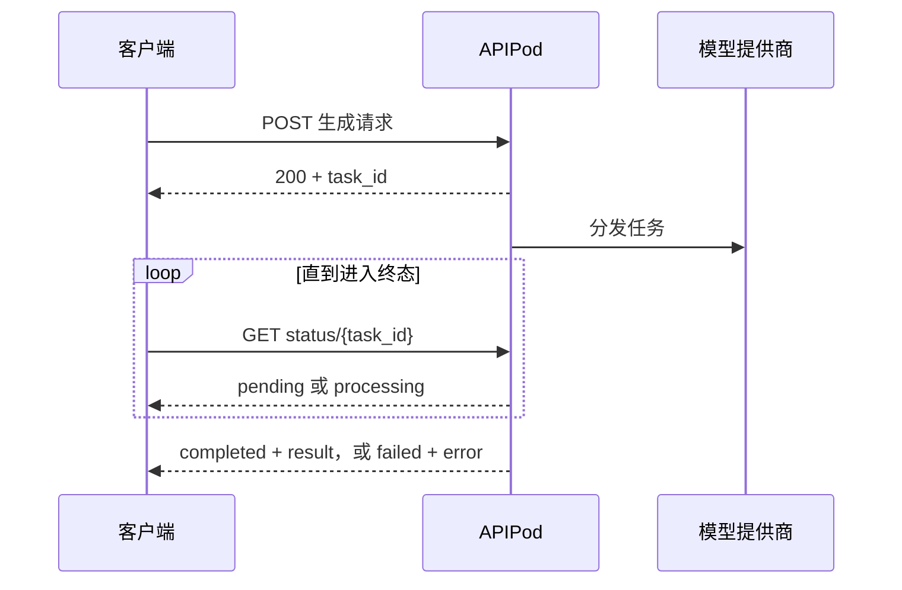

APIPod 图片和视频生成采用异步模式。创建请求会快速返回公开 `task_id`，生成过程在该 HTTP 请求结束后继续执行。



## 生命周期

| 状态 | 是否终态 | 客户端行为 |
| --- | --- | --- |
| `pending` | 否 | 等待后再次轮询 |
| `processing` | 否 | 使用退避策略继续轮询 |
| `completed` | 是 | 读取并持久化 `result` 中的 URL |
| `failed` | 是 | 检查错误，再决定是否创建新的逻辑任务 |
| `cancelled` | 是 | 停止轮询 |

内部结果收尾阶段对外仍显示为 `processing`，客户端不需要处理独立的 `finalizing` 状态。

## Seedance 家族 all-in-one 命名

`seedance-2.5`、`seedance-2.0`、`seedance-2.0-fast`、`seedance-2.0-mini` 是 all-in-one 模型 ID：一个模型覆盖全部场景，场景由请求素材自动推断：

| 素材 | 推断场景 |
| --- | --- |
| 仅提示词 | 文生视频 |
| 1-2 张图片且无视频/音频 | 图生视频（首帧或首尾帧） |
| 任一参考视频/音频，或超过 2 张图片 | 全模态参考生视频 |

用顶层 `role` 字段直接指定 `image_urls` 的语义：`first_last_frame` 表示 1-2 张图片按首帧 + 可选尾帧处理；`reference_images` 表示所有图片无论张数都按参考图处理。`first_last_frame` 不能与参考视频、参考音频同时使用。需要把场景固定在模型上时，场景后缀模型（`seedance-2.5-i2v`、`seedance-2.5-r2v` 等）依然可用。2.x 全系的参考视频时长与输出时长合并计费。

## 轮询端点

```bash
curl "https://api.apipod.ai/v1/images/status/$APIPOD_TASK_ID" \
  -H "Authorization: Bearer $APIPOD_API_KEY"
```

```bash
curl "https://api.apipod.ai/v1/videos/status/$APIPOD_TASK_ID" \
  -H "Authorization: Bearer $APIPOD_API_KEY"
```

状态查询按认证账号隔离，不会返回其他账号拥有的任务。

## 轮询策略

- 使用较短初始延迟，然后采用带随机抖动、有上限的指数退避。
- 进入终态后立即停止轮询。
- API 返回 `Retry-After` 时应遵循该值。
- 启动后台轮询前先持久化 `task_id`。
- 根据所选模型设置业务截止时间，不要假设所有模型都能在同一时长内完成。
- 如果结果尚未成为可交付 URL，即使上游已完成，APIPod 仍会保持 `processing` 直到媒体收尾完成。

## 图片与视频错误字段

图片状态响应可在 `data` 中返回 `error_code` 和 `error_message`；视频状态响应通过 `error` 返回客户端安全消息；Webhook 使用 `error` 和可选 `error_code`。读取结果或错误字段前，应先判断 `status`。

<CardGroup cols={2}>
  <Card title="使用 Webhook" icon="webhook" href="/zh-CN/webhooks">
    无需持续轮询即可接收任务终态结果。
  </Card>
  <Card title="处理错误" icon="circle-alert" href="/zh-CN/error-codes">
    统一处理 HTTP、同步和异步失败。
  </Card>
</CardGroup>
